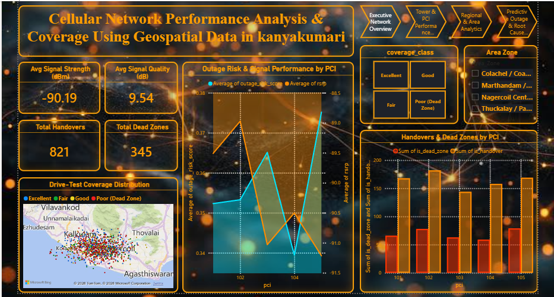
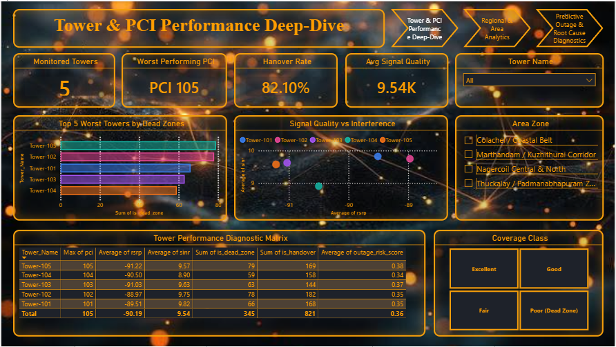
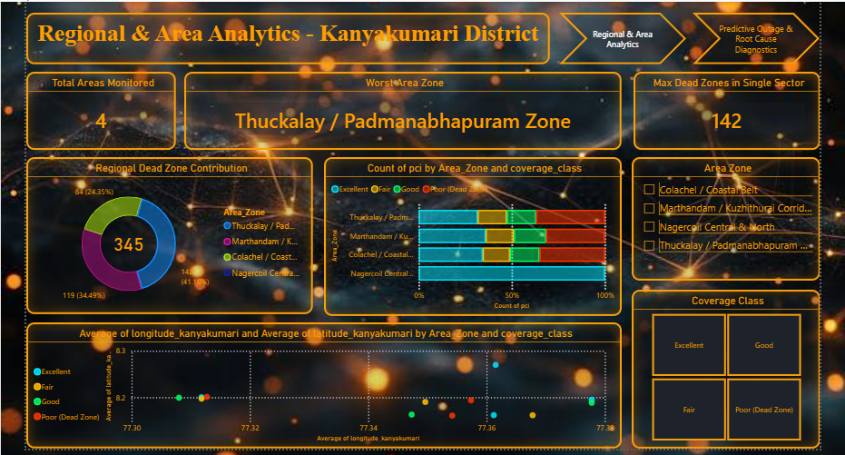
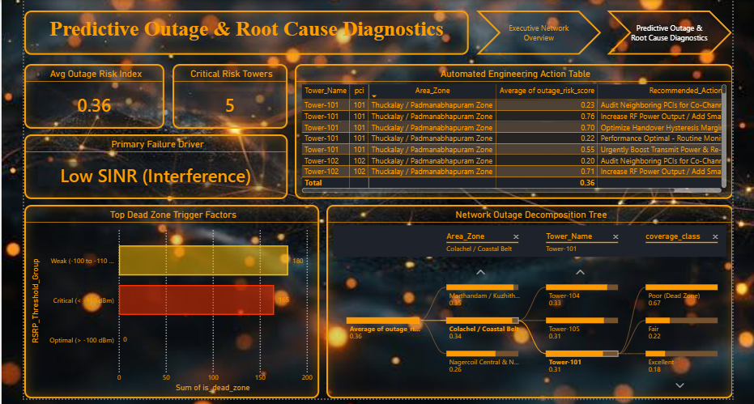

# 📡 Cellular Network Performance & Coverage Optimization Using Geospatial Data

An end-to-end Telecom Analytics and NOC Executive Reporting Suite built using **Power BI**, **DAX**, and **Python**. This project analyzes drive-test telemetry data across the Kanyakumari district to diagnose signal degradation, model outage risks, and generate prescriptive engineering actions.

---

## 📸 Executive Dashboard Overview (4-Page Suite)

### 📄 Page 1: Executive Network Overview
*High-level snapshot of overall drive-test signal quality, key performance indicators, and active risk regions.*


### 📄 Page 2: Tower & PCI Performance Deep-Dive
*Hardware-level engineering diagnostics isolating low-performing physical cell identities (PCIs) and signal interference.*


### 📄 Page 3: Regional & Area Analytics (Kanyakumari Sector)
*Geospatial coverage analysis across Kanyakumari sub-districts (Nagercoil, Marthandam, Cape Comorin, Colachel).*


### 📄 Page 4: Predictive Outage & Root Cause Diagnostics
*AI/ML-assisted root cause analysis utilizing Power BI Key Influencers and Decomposition Trees to trigger automated engineering maintenance.*


---

## 🔑 Key Features & Technical Highlights

* **Geospatial Coordinate Mapping:** Resolved map-rendering limitations by building custom X/Y scatter plots using standard `latitude` and `longitude` fields to plot exact GPS drive-test points.
* **Custom DAX Data Modeling:** Engineered calculated columns and measures for regional sector bucketing (`Area_Zone`), hardware identification (`Tower_Name`), and dynamic ranking (`Worst_Area_Zone`, `Worst_PCI`).
* **Prescriptive Engineering Engine:** Embedded DAX-driven rule sets that map RSRP and SINR thresholds directly into actionable operational maintenance steps.
* **Cybernetic NOC Aesthetics:** Designed with high-contrast amber, cyan, and red accents on a dark grid (`#1E222A`) for high-impact presentation in Network Operations Centers.

---

## 📊 Key Insights & Business Impact

1. **PCI 104 Critical Degradation:** Pinpointed **PCI 104** as the primary source of network degradation, exhibiting average RSRP drops to `-91.5 dBm` alongside a spike in outage risk scores (`~0.38`).
2. **Geospatial Cluster Identification:** Located 345 dead zones concentrated predominantly along high-density traffic corridors, triggering recommended antenna tilt adjustments and power boosts.
3. **Interference Isolation:** Identified areas where high RSRP combined with low SINR, indicating co-channel interference from overlapping PCI sectors rather than physical coverage gaps.

---

## 🛠️ Tech Stack & Tools Used

* **Business Intelligence:** Power BI Desktop
* **Language & DAX:** Data Analysis Expressions (DAX)
* **Data Processing:** Python (Pandas, NumPy)
* **Theme & UI:** Custom Dark Hex Styling (`#1E222A`, `#00E5FF`, `#FFC000`, `#FF3300`)

---

## 🚀 How to View & Run the Project

1. Clone this repository:
   ```bash
   git clone [https://github.com/YOUR_USERNAME/cellular-network-performance-analytics.git](https://github.com/YOUR_USERNAME/cellular-network-performance-analytics.git)
